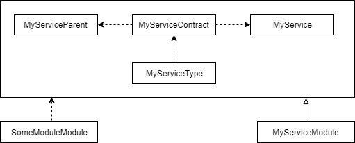
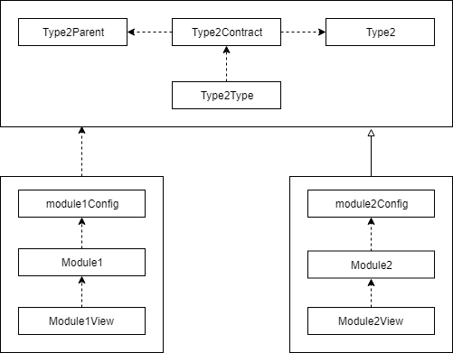

**Historical archive of Adjust due to 20200308 re-write**

Action: Re-write adjust into a set of distinct unique packages, which can be used in an application.
Decision: Currently the architecture of adjust is too interconnected. This makes it daunting to new collaborators as well as makes the code spagehtti. When an error occurs your not sure whether it's this package or that one, as they are all interconnected. Adjust needs to be more modular at its core, to allow easier usage by developers.

----


# Adjust <!-- omit in toc -->

This is a mono repository for the Adjust Application Framework. No official version of this framework has been released yet due to missing core features which are currently being added.

## Index <!-- omit in toc -->

- [Core functionality/principles](#core-functionalityprinciples)
  - [Dependency Inversion Principle](#dependency-inversion-principle)
  - [Settings](#settings)
  - [Model-View-Controller (MVC)](#model-view-controller-mvc)
- [GUI package](#gui-package)
  - [Settings Manager](#settings-manager)
  - [Location Manager](#location-manager)
  - [Themes](#themes)
- [Code example overview](#code-example-overview)
- [Typescript](#typescript)
- [Current state](#current-state)
  - [Contributing](#contributing)
- [Recommended IDE](#recommended-ide)

## Core functionality/principles

Adjust is an application framework primarily making use of [Electron](https://electronjs.org), [TypeScript](https://www.typescriptlang.org/) and [React](https://reactjs.org). Adjust intends to provide simple tools for developers to create powerful, well organised, highly adjustable applications. Applications build with Adjust are easily adjustable by both users and developers.

### Dependency Inversion Principle

One of the main problems Adjust solves is the tight coupling between modules that easily arises in any application. The approach Adjust takes to solve this, is to use the factory method pattern for most objects. This system consists of 3 parts/steps:

-   Create a contract (an interface) for a module.
-   Create a module that implements the contract.
-   Use the contract to request the module from the Registry.

The 'Registry' is a core part of Adjust that keeps track of all contracts and modules. In order to do this, an Adjust application will first scan the code directories for all modules to load them into the registry, and only then start the application. Future support will be added for storing this data to improve load times.

The huge benefit of this decoupling of modules is that additional packages can be installed, to replace existing modules to the user's liking. This is even the case for 3rd party modules! Ultimately, any part of your applications will be replaceable using plugins, saving you the time it'd take to build an API.

Another possibility this opens up, is that if your application provides multiple modules which deal with the same interface, Adjust can easily ask the user to choose which module is appropriate.

Below is an example of the 3 parts/steps for module communication

<details>
<summary>The contract, written in typescript: MyService.type.ts</summary>

```ts
import { Registry } from "@adjust/core";
import { ChildModule, ParentModule } from "@adjust/core/types";

export type MyService = ChildModule<{
    /**
     * This will do something
     * @param info Info on what to do
     * @returns A promise with some result,
     *      must always be a promise to keep implementations open ended
     *      (Implementation might want to use user interaction)
     */
    doSomething(info: string): Promise<void>;
}>;
export type MyServiceParent = ParentModule<{
    /**
     * Some callback that we expect to exist on the module that created an instance of MyService
     * This allows for returning of data to the parent at any time if required
     * This is preferred over callback passing as arguments, for future expandability
     * @param someData The data that we want the parent to receive
     */
    someCallback(someData: number): Promise<void>;
}>;
export type MyServiceContract = {
    parent: MyServiceParent;
    child: MyService;
    /**
     * Any data that we want our module to receive upon instantiation
     */
    data: {
        /**
         * The name of our MyService instance
         */
        name: string;
    };
};

// Export the contract as a "Type", which is essentially a runtime identifier for the contract
// (Module types shouldn't be confused with typescript types)
export const MyServiceType = Registry.createContractID<MyServiceContract>(
    // The location of the file, serving as a unique identifier
    __filename,
    // Any data about the contract, which can be displayed to the user
    {
        name: "MyService",
        description: "Example contract"
    }
);
```

</details>

<details>
<summary>An implementation of the contract: MyService.ts</summary>

```ts
import { createConfig, createModule } from "@adjust/core";
import { MyServiceType, MyService } from "./MyService.type";

// Declare a configuration for your module (Any possibly export it for extendability purposes)
export const myServiceConfig = createConfig({
    // Some data about the module, which can be displayed to the user
    details: {
        name: "MyService",
        description: "Example module"
    },
    // Declares a state and its initial values, very similar to a react state
    state: {
        info: ""
    },
    // Declares settings, which will be described in detail in another section
    settings: {},
    // Declares what interface this module implements, such that the Registry can read it
    type: MyServiceType
});

// Create the actual implementation itself
export class MyServiceModule extends createModule(myServiceConfig) implements MyService {
    /** @override */
    public async onInit(fromReload: false): Promise<void> {
        // This method is called on new instances when they are created
        // Here we can do any processing that has to happen
        //     before the parent calls methods on this instance
        // fromReload is present for have future quick module reloads during development,
        //     in which case a module's previous state is retained

        if (!fromReload)
            // Essentially react's setState, except that it performs a deep merge
            //     and changes are made synchronously
            this.changeState({
                // We can use getData to retrieve the data passed with the request
                info: this.getData().name + " is my name"
            });
    }

    /** @override */
    public async doSomething(info: string): Promise<void> {
        this.changeState({
            info
        });

        // Invoke some method on the parent, using the current state
        this.getParent().someCallback(this.state.info.length);
    }
}

// Export the module as a default, so the registry can read it
//     (named exports are better for bundling though, which is why this example includes both)
export default MyServiceModule;
```

<details>
<summary>We may omit some TS declarations, but it's prefered to keep them</summary>

```ts
export class MyServiceModule extends createModule(myServiceConfig) {
    async onInit(fromReload) {
        // etc
    }

    async doSomething(info) {
        // etc
    }
}
```

</details>
</details>

<details>
<summary>Another module using our contract: SomeModule.ts</summary>

```ts
import {createConfig, createModule} from "@adjust/core";
import {MyServiceType, MyService} from "./MyService.type";
// Just pretend this type exists
import {SomeModuleType, SomeModule} from "./SomeModule.type";

export const someModuleConfig = createConfig({
    // Use typescript's 'as' to specify what type of variables we are dealing with
    state: {
        dependency: null as MyService
        number: 0,
    },
    settings: {},
    type: SomeModuleType,
});

export class SomeModuleModule extends createModule(someModuleConfig) implements SomeModule {
    /** @override */
    public async onInit(fromReload: false): Promise<void> {
        if (!fromReload) {
            // Indirectly use the registry to get a module that implements the contract
            // This request can also prompt the user to choose a specific module if there are options
            const dependency = await this.request({
                type: MyServiceType,
                data: {
                    name: "John",
                }
            });

            // Store the instance for later usage
            this.changeState({
                dependency: dependency
            });

            // Use the dependency
            await dependency.doSomething("some info");
        }
    }

    // Implement our half of the contract
    /** @override */
    public async someCallback(someData: number): Promise<void> {
        // Now we can do whatever we want with this data
        this.changeState({
            number: someData
        });
    }
}
export default SomeModuleModule;
```

</details>

A simple compiletime dependency graph of these modules can look like this:


A module can be anything that could be seen as providing a service. Some examples: a colour picker; a field displaying a date (since people might want to format dates differently). You don't always have to use modules if you don't want to, and if you need more performance we would advise you avoid them, but you will lose the core benefits of Adjust. Otherwise it is generally recommended to use modules as much as possible, especially if it involves GUI.

### Settings

All modules come equipped with a simple, but extremely powerful system to manage settings. In order to use this system, you only have to declare the settings object in your config, after which you will be able to directly use them in your module.
The Adjust GUI package will come with components to display all the settings in your app, and allow users to change them, saving you a lot of time and effort. Users will be able to change settings for all instances of your module, and are given the ability to create "settings groups" that only apply to certain module instances. These groups contain conditions, that can for instance be based on the module's request data, or current state.

<details>
<summary>A simple example of some settings: MyService.ts</summary>

```ts
import {
    createConfig,
    createSetting,
    createModule,
    SettingStringType,
    SettingNumberType
} from "@adjust/core";
import { MyServiceType, MyService } from "./MyService.type";

export const myServiceConfig = createConfig({
    state: {
        info: ""
    },
    settings: {
        defaultInfo: createSetting({
            default: " is my name",
            type: SettingStringType
        }),
        someCategory: {
            someSetting: createSetting({
                default: 3,
                type: SettingNumberType
            })
        }
    },
    type: MyServiceType
});

// Create the actual implementation itself
export class MyServiceModule extends createModule(myServiceConfig) implements MyService {
    /** @override */
    public async onInit(fromReload: false): Promise<void> {
        if (!fromReload)
            this.changeState({
                // Read our setting data
                info: this.getData().name + this.settings.defaultInfo
            });
    }

    /** @override */
    public async doSomething(info: string): Promise<void> {
        this.changeState({
            info
        });

        // Use our setting data (for whatever reason)
        this.getParent().someCallback(
            this.state.info.length + this.settings.someCategory.someSetting
        );
    }
}

export default MyServiceModule;
```

</details>

### Model-View-Controller (MVC)

Adjust makes heavy use of the MVC paradigm, or more accurately MV\* paradigm since the model and controller are embedded in our 'Module' class. To create a GUI element, you create a 'view class' which extends the `React Component` class, and attach it to our module.

Modules are only instantiated in the main node process of our application, but their view classes can be instantiated in any window of the application. You can even create multiple view instances for the same module.

Within views, we can make use of request, state or settings data which represent the module. And we can call any of the module's public methods (through [IPC](https://electronjs.org/docs/api/ipc-main)) to interact with the module itself.
Any references to other modules within the state, will be translated to views of these modules in our view class. Such that we can directly render our dependencies as a part of our GUI.

<details>
<summary>A simple example of a module with a view: SomeModule.tsx</summary>

```tsx
import {createConfig, createModule, createModuleView, WindowManager} from "@adjust/core";
import {MyServiceType, MyService} from "./MyService.type";
// Just pretend this type exists
import {SomeModuleType, SomeModule} from "./SomeModule.type";

export const someModuleConfig = createConfig({
    // Use typescript's 'as' to specify what type of variables we are dealing with
    state: {
        dependency: null as MyService
        number: 0,
        // Add some data for our view's input
        info: "",
    },
    settings: {},
    type: SomeModuleType,
});

export class SomeModuleModule extends createModule(someModuleConfig) implements SomeModule {
    // The window to show this module in
    protected window: {ID: string, window: Promise<Electron.BrowserWindow>};

    /** @override */
    public async onInit(fromReload: false): Promise<void> {
        if (!fromReload) {
            const dependency = await this.request({
                type: MyServiceType,
                data: { name: "John" }
            });
            this.changeState({ dependency });
        }

        // Now in order to actually show a view for this module,
        //     we will have to create a window to show it in.
        //     Typically this step will only be done once, as
        //     generally you will want to use the location manager
        //     to take care of this for you.
        const windowID = Math.round(Math.random()*Math.pow(10, 10)) + ""; // Make sure this is unique
        const window = await WindowManager.openWindow(windowID, this.getID());
        window.on("close", ()=>{
            WindowManager.closeWindow(windowID);
        });

        // Possibly store the window for later usage
        this.window = {
            ID: windowID,
            window,
        });
    }

    /** @override */
    public async someCallback(someData: number): Promise<void> {
        this.changeState({
            number: someData
        });
    }

    // Add some methods for our view to call
    /**
     * Changes the info of our dependency
     * @param info The new info
     */
    public async changeInfo(info: string): Promise<void> {
        this.changeState({
            info
        });
        this.state.dependency.doSomething(info);
    }
}
export default SomeModuleModule;

// Create a view for our class
export class SomeModuleView extends createModuleView(SomeModuleModule) {
    /** @override */
    protected renderView(): JSX.Element {
        return (<div>
            <input
                value={this.state.info}
                onChange={(e)=>this.module.changeInfo(e.target.value)}/>

            Let's render "number", because why not?
            {this.state.number}

            And render our dependency, assuming it has a view itself:
            {this.state.dependency}
        </div>);
    }
}

// Simply exporting the view is enough, it will be attached by the registry.
// But we may also attach it ourselves using SomeModuleModule.setViewClass(SomeModuleView)
```

</details>

The use of [functional components and react hooks]() will be implemented in the future, but this might be challenging without compromising on extendability.

## GUI package

The Adjust GUI package extends the Adjust Core package, and provides standard common modules and views. Adjust GUI was separated from Adjust Core because it pushes a certain style on your application which makes it easier for you, but might not be what you want. Due to the nature of our own needs for this framework, this is hard to prevent.

Adjust GUI uses [Microsoft's fabric library](https://github.com/OfficeDev/office-ui-fabric-react) for many of it's components and encourages users of Adjust GUI to stick with this as well for consistency. We might provide packages where views can use components with other styles from different libraries instead, but this is by no means a priority at the moment. If you really dislike Microsoft's fabric you can always use Adjust GUI, extend the modules to fit your needs and override the existing modules using the registry.

All of the services that Adjust GUI provides, have been created using Adjust Modules, and therefore can be customised if desired.

### Settings Manager

Adjust GUI comes with a 'SettingsManager' module that can be requested. With this module, you can open a settings menu, and highlight/goto a specific setting you specify.
The GUI allows users to change the settings of all modules in the application, saving you time.

### Location Manager

Adjust GUI will also come with a "LocationsManager" which provides an elaborate system for displaying modules to the user. With this, a module can simply specify (and or create) a location that its GUI should be shown at.
This means that modules will not have to fiddle with managing windows themselves. It will also allow users to customise their GUI themselves with a simple drag/drop interface, and this data is persistent across instances, along with all other settings.

<details>
<summary>A simple example of how a module would declare its location</summary>

```ts
export const someModuleConfig = createConfig({
    state: {},
    settings: {},
    // Define a location with an ID,
    //  and give hints on how it should initially appear
    defineLocation: {
        ID: "myLocation",
        hints: {
            window: {
                new: true,
                name: "MyWindow"
            },
            tab: {
                new: true,
                ID: "MyTab"
            }
        }
    },
    type: SomeModuleType
});
```

When we want another module to appear in an already existing location, we can simply pass that location ID as well. If multiple modules share one location, it will simply show the module that last requested focus in this module.

```ts
export const someModuleConfig = createConfig({
    state: {},
    settings: {},
    location: "myLocation",
    type: SomeModuleType
});
```

</details>

<details>
<summary>A simple example of how to indicate that you want a requested module's GUI to be rendered in its specified view</summary>

```ts
await this.request({
    type: SomeModuleType,
    openView: true,
}),
```

We would not want to pass `openView: true` if we are planning on embedding the module's GUI in our own GUI.

</details>

The default locations are built up of 3 levels (but additional modules can be added to add more levels):

-   Window manager, which allows for multiple windows
-   Section manager, which allows for multiple resize-able sections in each window
-   Tab manager, which allows for multiple tabs in each section

With these 3 levels for each location, you essentially end up with a system similar to programs like photoshop, where you can customise the layout of the whole program.

### Themes

Adjust GUI provides a `ThemeManager` which uses react contexts to provide the whole application with a single coherent theme. This theme can be altered by the user in the settings, if they prefer different colours, fonts, etc. It's even possible to override the theme of a specific module, and its descendants, within the settings.
In addition, it will allow the user to specify css styling for any module within the settings, allowing users to tweak your application to fit their own personal requirements.

Adjust GUI also injects [emotion](https://github.com/emotion-js/emotion) into React allowing you to import React from Adjust GUI and use Emotion's css property.

Modules will be able to use the theme in several ways:

<details>
    <summary>A Box element</summary>

```tsx
import { createModuleView } from "@adjust/gui";

//...

export class SomeModuleView extends createModuleView(SomeModuleModule) {
    /** @override */

    protected renderView(): JSX.Element {
        return (
            <Box background="primary" margin="l">
                Some content
            </Box>
        );
    }
}
```

The box element can take a large number of standard attributes, to apply the theme to.
It will simply render as a div, with the attributes obtained from the theme and applied as css.

</details>

<details>
<summary>A theme hook</summary>

```tsx
import { createModuleView, useTheme } from "@adjust/gui";

//...

const SomeReusableComponent: FunctionComponent = ({ children }) => {
    const theme = useTheme();
    return (
        <div
            style={{
                backgroundColor: theme.getColor("primary"),
                margin: theme.getSpacing("l")
            }}
        >
            {children}
        </div>
    );
};

export class SomeModuleView extends createModuleView(SomeModuleModule) {
    /** @override */

    protected renderView(): JSX.Element {
        return <SomeReusableComponent>Some content</SomeReusableComponent>;
    }
}
```

</details>

<details>
<summary>Using Emotion's CSS callback</summary>

```tsx
import { createModuleView } from "@adjust/gui";

//...

export class SomeModuleView extends createModuleView(SomeModuleModule) {
    /** @override */
    protected renderView(): JSX.Element {
        return (
            <div
                css={theme => ({
                    backgroundColor: theme.getColor("primary"),
                    margin: theme.getSpacing("l")
                })}
            >
                Some content
            </div>
        );
    }
}
```

</details>

## Code example overview

Comments on all components have been left out to reduce the size in order to provide a better overview. You can go through the code examples in the spoilers above for the details.

<details open>
<summary>A contract, written in typescript: Type2.type.ts</summary>

```ts
import { Registry } from "@adjust/core";
import { ChildModule, ParentModule } from "@adjust/core/types";

export type Type2 = ChildModule<{
    doSomething(info: string): Promise<void>;
}>;
export type Type2Parent = ParentModule<{
    someCallback(someData: number): Promise<void>;
}>;
export type Type2Contract = {
    parent: Type2Parent;
    child: Type2;
    data: {
        name: string;
    };
};

export const Type2Type = Registry.createContractID<Type2Contract>(__filename, {
    name: "Type2",
    description: "Example contract"
});
```

</details>

<details open>
<summary>An implementation of the contract: Module2.ts</summary>

```tsx
import { createConfig, createSetting, createModule, createModuleView, Box } from "@adjust/gui";
import { Type2Type, Type2 } from "./Type2.type";

export const module2Config = createConfig({
    details: { name: "Module2", description: "Example module" },
    state: {
        info: ""
    },
    settings: {
        defaultInfo: createSetting({
            default: " is my name",
            type: SettingStringType
        })
    },
    type: Type2Type
});

export class Module2 extends createModule(module2Config) implements Type2 {
    public async onInit(fromReload: false): Promise<void> {
        if (!fromReload)
            this.changeState({
                info: this.getData().name + this.settings.defaultInfo
            });
    }

    public async doSomething(info: string): Promise<void> {
        this.changeState({ info });
        this.getParent().someCallback(this.state.info.length);
    }
}
export default Module2;

export class Module2View extends createModuleView(Module2) {
    protected renderView(): JSX.Element {
        return (
            <Box color="primary" onClick={() => this.module.doSomething()}>
                {this.state.info}
            </Box>
        );
    }
}
```

</details>

<details open>
<summary>Another module using our contract: Module1.ts</summary>

```tsx
import {createConfig, createModule, createModule, createModuleView, Box} from "@adjust/gui";
import {Type2Type, Type2} from "./Type2.type";
// Just pretend this type exists
import {Type1Type, Type1} from "./Type1.type";

export const module1Config = createConfig({
    state: {
        dependency: null as MyService
        number: 0,
    },
    settings: {},
    defineLocation: {
        ID: "myLocation",
        hints:{ window:{ new: true, name: "MyWindow" }},
    },
    type: Type1Type,
});

export class Module1 extends createModule(module1Config) implements Type1 {
    public async onInit(fromReload: false): Promise<void> {
        if (!fromReload) {
            const dependency = await this.request({
                type: MyServiceType,
                data: { name: "John" }
            });
            this.changeState({ dependency });
            await dependency.doSomething("some info");
        }
    }

    public async someCallback(someData: number): Promise<void> {
        this.changeState({ number: someData });
    }
}
export default Module1;

export class Module1View extends createModuleView(Module1) {
    protected renderView(): JSX.Element {
        return (
            <Box backgroundColor="neutralPrimary">
                {this.state.number} {this.state.dependency}
            </Box>
        );
    }
}
```

</details>

In general, the dependencies within 2 modules and their relation can be represented with the following diagram:


## Typescript

Adjust makes heavy use of typescript. It uses advanced typescript features in order to give powerful intellisense.
Using this intellisense, you can easily spot small mistakes, and nicely refactor code.
TypeScript error messages themselves can be confusing, but hopefully this will be improved in future versions of Adjust or TypeScript.

Adjust extracts the type of your state, settings and contract from your config. It then uses this data in the `createModule()` method, allowing use of intellisense both when using and changing the state and settings.

Similarly it passes this data, as well as the module's methods, to your view when calling `createModuleView()`. Such that you always know what data can be used for rendering and what callbacks can be made.

Adjust tries to provide this powerful intellisense, without too much declarative typescript overhead. Most of the actual typescript declarations will be done when defining the contract, but here it also serves as a way to clearly specify intent. Other developers will therefore have minimal effort in using your contracts, or creating extended modules for it.

Here are a couple of examples of typescript detecting errors:

<details>
<summary>incorrect setting type</summary>


</details>

<details>
<summary>incorrect state type</summary>


</details>

<details>
<summary>module state in view</summary>


</details>

<details>
<summary>incorrect module method</summary>


</details>

## Current state

Most of Adjust Core is functional, a lot of Adjust GUI is still a work in progress however.

Breakdown:

```
Adjust GUI: settings menu   - Work in progress
Adjust GUI: section manager - Not Started
Test project                - Messy but functional
Adjust website              - Work in progress
Adjust online docs          - Work in progress
Adjust demo project         - Not Started, requires Settings menu
Adjust installer            - Not Started, requires Settings menu
```

We also have a [Kanban board](https://github.com/orgs/LaunchMenu/projects/1) tracking these tasks (albeit a bit messy)

### Contributing

If you would like to contribute in any way, E.G:

-   Create modules for Adjust GUI
-   Add core capabilities to Adjust Core or improve performance
-   Help with refactoring of current code
-   Help with UI design of Adjust GUI
-   Create a logo for Adjust

Don't hesitate to contact us. The easiest way would be to [create an issue](https://github.com/LaunchMenu/Adjust/issues) on this project to start the conversation.

## Recommended IDE

We recommend using [Visual Studio Code](https://code.visualstudio.com/). VSC is multi-platform and has in-built TypeScript support. Currently we are keen to create plugins for VSC e.g. type and module template generators. When implemented, these plugins will be recommended automatically by VSC when entering the template and demo applications.
